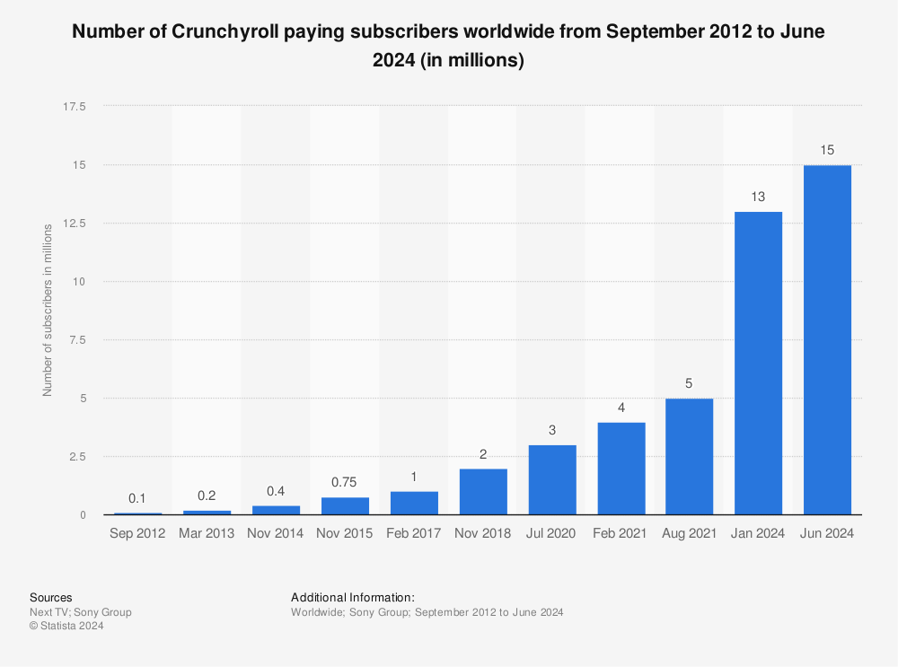
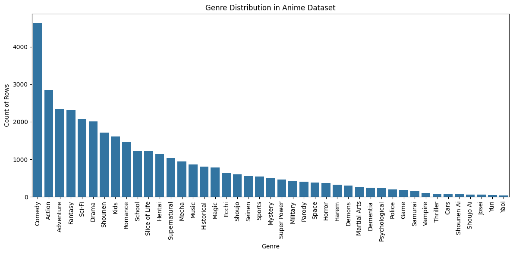
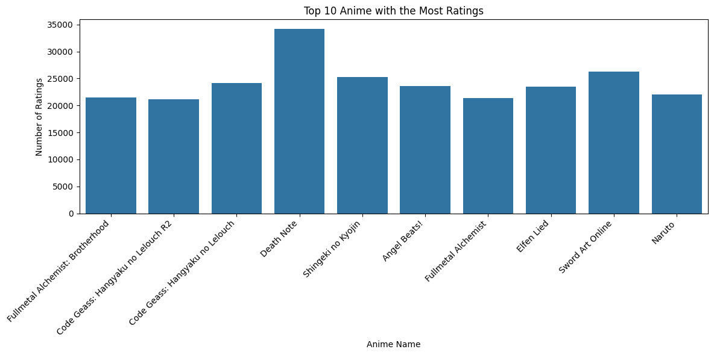

# Laporan Proyek Machine Learning Terapan - Carolus Christadi Cahyono

## Project Overview

Dalam era digital yang terus berkembang, kebutuhan akan sistem rekomendasi semakin penting, terutama dalam bidang hiburan seperti anime. Menurut data dari Crunchyroll menunjukkan pertumbuhan jumlah pelanggan berbayar secara signifikan dari tahun 2012 hingga 2024, dengan jumlah mencapai lebih dari 10 juta pelanggan pada Juni 2024 [1] Selain itu, banyak layanan populer seperti Netflix, Prime, Video, dll yang mengadopsi anime sebagai salah satu media hiburan dalam layanan streaming mereka.

Dengan semakin banyaknya pilihan anime yang tersedia, layanan streaming sering kali mengalami kesulitan dalam memilih tontonan yang sesuai dengan preferensi user. Oleh karena itu, diperlukan suatu sistem rekomendasi yang mampu membantu pengguna menemukan anime yang relevan berdasarkan kesamaan konten atau preferensi pengguna sebelumnya.

Proyek ini bertujuan untuk membangun sistem rekomendasi anime menggunakan pendekatan *Content-Based Filtering* dengan memanfaatkan data dari Kaggle: [Anime Recommendation Database](https://www.kaggle.com/datasets/CooperUnion/anime-recommendations-database).[2] Pendekatan ini bekerja dengan menganalisis fitur dari anime itu sendiri (seperti genre) dan mencocokkannya dengan preferensi pengguna untuk memberikan rekomendasi yang relevan.

Menurut Ricci, sistem rekomendasi berbasis konten sangat efektif digunakan ketika data historis interaksi pengguna terbatas atau preferensi pengguna baru belum banyak diketahui (*cold start*). Dengan pendekatan ini, sistem tetap dapat memberikan saran berdasarkan kemiripan fitur antar item.[3]

## Business Understanding

### Problem Statements

- Bagaimana cara merekomendasikan anime kepada pengguna berdasarkan preferensi mereka terhadap anime yang pernah ditonton sebelumnya?
- Bagaimana cara mengukur kesamaan antar anime menggunakan fitur konten seperti genre?

### Goals

- Membangun model sistem rekomendasi anime berbasis *content-based filtering* menggunakan informasi konten (genre).
- Menghasilkan rekomendasi anime yang relevan bagi pengguna dengan mengukur kemiripan antar genre anime.

### Solution Statements

Untuk mencapai tujuan tersebut, pendekatan yang akan digunakan adalah sebagai berikut:

**Content-Based Filtering menggunakan Cosine Similarity**  
Pendekatan ini akan menggunakan vektorisasi genre anime dalam bentuk *TF-IDF* atau *One-Hot Encoding*, kemudian menghitung kesamaan antar anime menggunakan *cosine similarity*. Anime yang paling mirip dengan anime yang disukai pengguna akan direkomendasikan.

---

**Referensi**:  
[1] Statista, "Number of Crunchyroll paying subscribers worldwide from September 2012 to June 2024," Statista, 2023. [Online]. Available: https://www.statista.com/statistics/594952/crunchyroll-users/. [Accessed: May 3, 2025].

[2] Cooper Union, "Anime Recommendations Database," Kaggle. [Online]. Available: https://www.kaggle.com/datasets/CooperUnion/anime-recommendations-database. [Accessed: May 3, 2025].

[3] F. Ricci, L. Rokach, and B. Shapira, Introduction to Recommender Systems Handbook. Springer, 2011.

## Data Understanding

Dataset yang digunakan dalam proyek ini adalah **Anime Recommendation Database** yang berasal dari Kaggle dan dapat diakses melalui tautan berikut: [Kaggle - Anime Recommendations Database](https://www.kaggle.com/datasets/CooperUnion/anime-recommendations-database).

Terdapat dua file utama:
1. **anime.csv**: Berisi informasi metadata terkait anime.
2. **rating.csv**: Berisi informasi rating yang diberikan oleh pengguna terhadap anime.

### Variabel pada anime.csv:
- `anime_id`: ID unik dari setiap anime di MyAnimeList.
- `name`: Nama lengkap dari anime.
- `genre`: Genre dari anime, dipisahkan dengan koma jika lebih dari satu.
- `type`: Tipe dari anime (TV, Movie, OVA, dll).
- `episodes`: Jumlah episode.
- `rating`: Rata-rata rating dari pengguna.
- `members`: Jumlah pengguna yang menambahkan anime ke daftar mereka.

### Variabel pada rating.csv:
- `user_id`: ID unik dari pengguna.
- `anime_id`: ID anime yang dirating oleh pengguna.
- `rating`: Nilai rating (1-10), atau -1 jika pengguna tidak memberikan rating eksplisit.

---

### Eksplorasi `anime.csv`

#### 1. `.head()`
Menampilkan 5 data teratas dari dataframe `anime_df`. Berguna untuk melihat struktur awal data.

#### 2. `.describe()`
Memberikan ringkasan statistik deskriptif terhadap kolom numerik seperti `rating` dan `members`.

**Insight:**
- Rata-rata rating anime adalah 6.47.
- Rating maksimal adalah 10, sedangkan minimum 1.67.
- Jumlah anggota komunitas (members) sangat bervariasi, dengan maksimum mencapai lebih dari 1 juta.

#### 3. `.info()`
Digunakan untuk melihat tipe data dan jumlah non-null.

**Insight:**
- Total ada 12.294 entri.
- Kolom `genre` memiliki 62 missing values.
- Kolom `type` memiliki 25 missing values.
- Kolom `rating` memiliki 230 missing values.
- Tipe data kolom `episodes` masih berupa string karena ada nilai seperti `'Unknown'`.

#### 4. `isnull().sum()`
Menampilkan jumlah missing values untuk setiap kolom.

**Insight tambahan:**
- Missing values pada `type` dan `rating` kemungkinan besar berasal dari anime yang belum tayang atau belum memiliki cukup data.

---

### Eksplorasi `rating.csv`

#### 1. `.head()`
Menampilkan 5 baris pertama dari `rate_df`.

**Insight:**
- Banyak pengguna memberikan rating `-1`, yang berarti mereka telah menonton namun tidak memberikan rating eksplisit.

#### 2. `.describe()`
Memberikan statistik deskriptif untuk kolom `user_id`, `anime_id`, dan `rating`.

**Insight:**
- Dataset terdiri dari 7.813.737 entri.
- Rating memiliki nilai minimum -1 dan maksimum 10.
- Rata-rata rating adalah 6.14 dengan standar deviasi 3.73, yang menunjukkan sebaran nilai rating cukup lebar akibat adanya nilai -1.

#### 3. `.info()`
Digunakan untuk melihat tipe data dan non-null count dari setiap kolom.

**Insight:**
- Semua kolom bertipe integer dan tidak memiliki missing values.

#### 4. `isnull().sum()`
Menampilkan 0 nilai kosong di seluruh kolom, berarti data lengkap secara struktur.

---

### Insight :

- Banyak nilai `rating = -1` pada `rating.csv` perlu di-filter sebelum proses pembobotan kemiripan dilakukan.
- Beberapa entri pada `anime.csv` seperti `episodes = "Unknown"` atau `type = NaN` perlu diproses atau diabaikan sesuai relevansi proyek.
- Distribusi genre cukup bervariasi dan dapat digunakan sebagai fitur penting untuk filtering.

---

### Visualisasi

Visualisasi data pada project ini bertujuan untuk memudahkan dan memahami data lebih lanjut. Oleh karena itu, dibuatlah visualisai sebagai berikut, 

#### Persebaran genre anime 

Data menggabungkan keseluruhan genre menjadi suatu string pada kolom sehingga sulit dibaca, oleh karena itu, dilakukan beberapa tahap sebagai berikut:

- Membuat genre sebagai list
- Melihat genre-genre yang ada dalam dataset
- Menghitung setiap genre
- Menampilkan dalam bentuk bar chart

#### Top 10 anime dengan rating tertinggi

Dataset yang diberikat pada rating.csv perlu di proses kembali agar bisa melihat total rating untuk satu anime sehingga dibuatlah langkah-langkah untuk dapat melakukan visualisasi

- Filter data dengan -1
- Melakukan grouping untuk setiap anime dengan anime_id yang sama dan melihat jumlah rating
- Mencari anime dengan 10 rating tertinggi
- Menampilkan dalam bentuk bar chart

---

## Data Preparation

Pada bagian ini, dilakukan serangkaian langkah-langkah data preparation untuk memastikan data yang digunakan dalam analisis atau pemodelan sudah bersih, lengkap, dan siap diproses lebih lanjut.

### Data Preparation untuk `anime_df`

1. **Menghapus Data Null pada Kolom Genre dan Type**  
   Langkah pertama yang dilakukan adalah menghapus baris yang memiliki nilai `null` pada kolom `genre` dan `type`. Hal ini penting karena kolom-kolom tersebut mengandung informasi yang sangat penting untuk analisis lebih lanjut, dan data yang hilang dapat mengganggu proses selanjutnya.

2. **Mengisi Data Null pada Kolom Rating**  
   Setelah itu, dilakukan pengisian nilai `null` pada kolom `rating` dengan nilai `0`. Hal ini dilakukan untuk menghindari gangguan dari nilai kosong yang dapat menyebabkan error dalam pemrosesan data.

3. **Menghapus Data Duplikat**  
   Selanjutnya, data duplikat berdasarkan nama anime dihapus. Duplikat dalam dataset dapat menyebabkan distorsi dalam analisis, sehingga sangat penting untuk menghapusnya agar data lebih akurat.

4. **Mengubah Nilai 'Unknown' pada Kolom Episodes**  
   Kolom `episodes` mengandung nilai `'Unknown'` yang perlu diubah menjadi `0`. Kemudian, nilai tersebut diubah menjadi tipe data numerik (`int32`) agar dapat digunakan dalam analisis lebih lanjut.

5. **Membersihkan Kolom Genre**  
   Kolom `genre` yang berisi genre-genre anime diproses lebih lanjut dengan mengganti spasi di dalam genre menjadi tanda garis bawah (`_`). Hal ini dilakukan agar genre dapat lebih mudah diproses pada tahap selanjutnya, seperti saat menggunakan teknik tokenisasi dengan `tf-idf`.

### Data Preparation untuk `rate_df`

1. **Menghapus Data Duplikat pada `rate_df`**  
   Duplikat pada `rate_df` dihapus untuk menjaga data tetap bersih dan konsisten. Hal ini dilakukan untuk memastikan bahwa setiap rating hanya tercatat sekali per anime per pengguna.

2. **Menghapus Rating yang Tidak Valid**  
   Data yang memiliki rating `-1`, yang menandakan anime yang ditonton tetapi tidak diberi rating, dihapus untuk memastikan hanya data rating yang valid yang dipertimbangkan dalam analisis.

3. **Memeriksa Missing Values**  
   Terakhir, dilakukan pengecekan untuk memastikan bahwa tidak ada nilai yang hilang pada dataset `rate_df` setelah dilakukan pembersihan.

### Penjelasan Mengapa Data Preparation Diperlukan

Data preparation adalah tahap yang sangat penting dalam proses analisis data karena:
- **Menghapus data null** pada kolom yang krusial (seperti genre dan type) mencegah terjadinya kesalahan analisis atau model yang tidak akurat.
- **Mengisi nilai null** pada kolom rating dengan angka `0` untuk memastikan bahwa tidak ada nilai kosong yang dapat mengganggu proses perhitungan atau analisis.
- **Menghapus data duplikat** menghindari adanya bias dalam analisis dan memastikan bahwa setiap baris data hanya mewakili satu entitas unik.
- **Mengubah data yang tidak valid** seperti nilai `'Unknown'` pada kolom episodes memastikan bahwa data menjadi lebih konsisten dan dapat digunakan dalam analisis numerik.
- **Membersihkan genre** agar lebih siap digunakan dalam tokenisasi dan proses pemodelan teks.

Langkah-langkah data preparation yang dilakukan memastikan bahwa dataset yang digunakan bersih, konsisten, dan siap untuk analisis atau pemodelan lebih lanjut.

---

## Modeling and Results

Pada tahap ini, sistem rekomendasi dibangun dengan pendekatan *content-based filtering* menggunakan teknik *cosine similarity* untuk menghitung kemiripan antar anime berdasarkan fitur konten.

### 1. Vektorisasi Genre Menggunakan TF-IDF

Kolom `genre_cleaned` yang telah diproses sebelumnya diubah menjadi bentuk numerik menggunakan TF-IDF (*Term Frequency-Inverse Document Frequency*). TF-IDF digunakan untuk memberikan bobot pada setiap genre berdasarkan frekuensi kemunculannya di seluruh dataset, sehingga genre yang unik akan mendapat bobot lebih tinggi. Ini memungkinkan sistem untuk membedakan anime secara lebih tajam berdasarkan genre-nya.

### 2. One-Hot Encoding pada Kolom `type`

Kolom `type` diubah menjadi representasi numerik dengan teknik one-hot encoding. Ini memungkinkan tipe anime (TV, Movie, OVA, dll) dipertimbangkan sebagai fitur numerik dalam proses perhitungan kemiripan.

### 3. Penambahan Fitur Numerik Lainnya

- **Rating** ditambahkan secara langsung sebagai fitur karena mencerminkan kualitas atau kepuasan umum terhadap anime.
- **Members** (jumlah pengguna yang menonton) dinormalisasi menggunakan *StandardScaler* untuk menyamakan skala dengan fitur lainnya, karena kolom ini memiliki rentang nilai yang besar.

Semua fitur (TF-IDF genre, tipe, rating, dan members) kemudian digabung menjadi satu matriks fitur akhir yang akan digunakan dalam perhitungan kemiripan.

### 4. Perhitungan Cosine Similarity

Dengan matriks fitur akhir, sistem menghitung kemiripan antar semua pasangan anime menggunakan metrik *cosine similarity*. Hasilnya adalah sebuah matriks simetri di mana setiap nilai menunjukkan tingkat kemiripan antara dua anime.

Matriks ini disimpan dalam bentuk DataFrame dengan nama dan indeks anime sebagai baris dan kolomnya. Matriks inilah yang menjadi dasar utama dari sistem rekomendasi.

### 5. Fungsi Rekomendasi

Fungsi utama yang dibangun adalah `generate_user_recommendations`, yang bertujuan menghasilkan daftar rekomendasi berdasarkan preferensi pengguna. Penjelasan logika fungsi:

- **Input**: 
  - `user_id`: ID pengguna.
  - `num_recommendations`: jumlah anime yang direkomendasikan.
  - `anime_data`: dataset anime yang telah diproses.
  - `ratings_data`: data interaksi pengguna.
  - `similarity_matrix`: matriks cosine similarity.

- **Langkah-langkah dalam fungsi**:
  1. Mengambil anime yang sudah ditonton oleh pengguna dan mengurutkannya berdasarkan rating tertinggi.
  2. Memilih 10 anime teratas yang paling disukai oleh pengguna.
  3. Membandingkan anime yang belum pernah ditonton oleh pengguna dengan 10 anime teratas tersebut menggunakan rata-rata nilai cosine similarity.
  4. Mengurutkan semua anime yang belum ditonton berdasarkan skor kemiripan dan memilih Top-N sebagai hasil rekomendasi.

- **Output**:
  - Daftar anime yang paling disukai oleh pengguna (berdasarkan rating).
  - Daftar anime yang direkomendasikan berdasarkan kemiripan konten.

Fungsi ini memungkinkan sistem untuk memberikan rekomendasi yang bersifat personal untuk setiap pengguna berdasarkan kemiripan konten anime yang telah mereka sukai sebelumnya.

Hasil akhir dari model ini adalah sistem yang mampu merekomendasikan anime yang belum ditonton, tetapi memiliki genre, tipe, dan karakteristik serupa dengan anime favorit pengguna.

Untuk user 3 dengan top-n 10, mendapatkan hasil sebagai berikut

## Hasil Top Rated dan Top Recommended

Berikut ini merupakan anime yang paling disukai (Top Rated) oleh pengguna dan hasil rekomendasi sistem (Top Recommended) berdasarkan model content-based filtering:

### Top Rated

| anime_id | Name                                       | Rating | Genre                                       |
|----------|--------------------------------------------|--------|---------------------------------------------|
| 199      | Sen to Chihiro no Kamikakushi              | 10     | Adventure, Drama, Supernatural              |
| 813      | Dragon Ball Z                              | 10     | Action, Adventure, Comedy, Fantasy, Martial_Arts |
| 5114     | Fullmetal Alchemist: Brotherhood           | 10     | Action, Adventure, Drama, Fantasy, Magic, Military |
| 1535     | Death Note                                  | 10     | Mystery, Police, Psychological, Supernatural, Thriller |
| 18115    | Magi: The Kingdom of Magic                 | 10     | Action, Adventure, Fantasy, Magic, Shounen |
| 20159    | Pokemon: The Origin                        | 10     | Action, Adventure, Comedy, Fantasy, Kids    |
| 28171    | Shokugeki no Souma                         | 10     | Ecchi, School, Shounen                      |
| 14513    | Magi: The Labyrinth of Magic               | 10     | Action, Adventure, Fantasy, Magic, Shounen |
| 11771    | Kuroko no Basket                           | 10     | Comedy, School, Shounen, Sports             |
| 16894    | Kuroko no Basket 2nd Season                | 10     | Comedy, School, Shounen, Sports             |

### Top Recommended

| anime_id | Name                                       | Score    | Genre                                       |
|----------|--------------------------------------------|----------|---------------------------------------------|
| 1482     | D.Gray-man                                 | 0.959457 | Action, Adventure, Comedy, Shounen          |
| 11061    | Hunter x Hunter (2011)                     | 0.958942 | Action, Adventure, Shounen, Super_Power     |
| 205      | Samurai Champloo                           | 0.958210 | Action, Adventure, Comedy, Historical, Samurai |
| 1195     | Zero no Tsukaima                           | 0.958025 | Action, Adventure, Comedy, Ecchi, Fantasy, Harem |
| 23273    | Shigatsu wa Kimi no Uso                    | 0.957865 | Drama, Music, Romance, School, Shounen      |
| 1818     | Claymore                                   | 0.957716 | Action, Adventure, Demons, Fantasy, Shounen, Supernatural |
| 18897    | Nisekoi                                     | 0.957604 | Comedy, Harem, Romance, School, Shounen     |
| 24833    | Ansatsu Kyoushitsu (TV)                    | 0.957524 | Action, Comedy, School, Shounen             |
| 223      | Dragon Ball                                | 0.957376 | Adventure, Comedy, Fantasy, Martial_Arts, Shounen |
| 14813    | Yahari Ore no Seishun Love Comedy wa Machigatteiru. | 0.957357 | Comedy, Drama, Romance, School              |

---

## Evaluation

Pada tahap evaluasi, dilakukan pengukuran seberapa relevan hasil rekomendasi terhadap preferensi pengguna berdasarkan genre. Evaluasi ini menggunakan pendekatan *content-based filtering* dan mengevaluasi kualitas hasil dengan dua metrik utama: **Genre Relevance Score** dan **Precision**.

### 1. Genre Relevance Score

Genre Relevance Score digunakan untuk mengukur seberapa besar kemiripan genre antara anime rekomendasi dengan anime yang paling disukai pengguna. Skor ini dihitung berdasarkan proporsi genre tertentu pada 10 anime favorit pengguna.

#### a. Rumus Perhitungan

1. Hitung frekuensi kemunculan setiap genre dalam anime favorit:

$$
\text{Genre Frequency}(g_i) = \frac{\text{Jumlah genre } g_i \text{ dalam top liked anime}}{\text{Total semua genre}}
$$

2. Skor genre untuk setiap anime rekomendasi dihitung sebagai:

$$
\text{Genre Score}(a_i) = \sum_{g \in \text{genre}(a_i)} \left( \frac{\text{count}(g)}{\text{total genre}} \times 100 \right)
$$

#### b. Contoh Hasil

Berikut adalah sebagian hasil evaluasi genre relevance:

| #  | anime_id | Name                                               | Score    | Genre                                                     | Genre Relevance Scores                                   | Total Genre Relevance Score |
|----|----------|----------------------------------------------------|----------|-----------------------------------------------------------|----------------------------------------------------------|-----------------------------|
| 3  | 1195     | Zero no Tsukaima                                   | 0.958025 | Action, Adventure, Comedy, Ecchi, Fantasy, Harem, ...     | [10.42, 12.5, 8.33, 2.08, 10.42, 0.0, 6.25, ...]          | 56.25                      |
| 5  | 1818     | Claymore                                           | 0.957716 | Action, Adventure, Demons, Fantasy, Shounen, ...          | [10.42, 12.5, 0.0, 10.42, 14.58, 2.08, 4.17]              | 54.17                      |
| 8  | 223      | Dragon Ball                                        | 0.957376 | Adventure, Comedy, Fantasy, Martial_Arts, Shounen, ...    | [12.5, 8.33, 10.42, 2.08, 14.58, 2.08]                    | 49.99                      |
| 0  | 1482     | D.Gray-man                                         | 0.959457 | Action, Adventure, Comedy, Shounen                        | [10.42, 12.5, 8.33, 14.58]                                | 45.83                      |
| 2  | 205      | Samurai Champloo                                   | 0.958210 | Action, Adventure, Comedy, Historical, Samurai, ...       | [10.42, 12.5, 8.33, 0.0, 0.0, 14.58]                      | 45.83                      |
| 1  | 11061    | Hunter x Hunter (2011)                             | 0.958942 | Action, Adventure, Shounen, Super_Power                   | [10.42, 12.5, 14.58, 2.08]                                | 39.58                      |
| 7  | 24833    | Ansatsu Kyoushitsu (TV)                            | 0.957524 | Action, Comedy, School, Shounen                           | [10.42, 8.33, 6.25, 14.58]                                | 39.58                      |
| 6  | 18897    | Nisekoi                                            | 0.957604 | Comedy, Harem, Romance, School, Shounen                   | [8.33, 0.0, 0.0, 6.25, 14.58]                             | 29.16                      |
| 4  | 23273    | Shigatsu wa Kimi no Uso                            | 0.957865 | Drama, Music, Romance, School, Shounen                    | [4.17, 0.0, 0.0, 6.25, 14.58]                             | 25.00                      |
| 9  | 14813    | Yahari Ore no Seishun Love Comedy wa Machigatteiru | 0.957357 | Comedy, Drama, Romance, School                            | [8.33, 4.17, 0.0, 6.25]                                   | 18.75                      |

Nilai ini menunjukkan anime dengan genre yang paling banyak beririsan dengan anime favorit pengguna.

---

### 2. Precision

Metrik **Precision** digunakan untuk mengetahui proporsi rekomendasi yang dianggap relevan berdasarkan nilai threshold Genre Relevance Score.

#### a. Rumus Precision

$$
\text{Precision} = \frac{\text{Jumlah anime dengan skor ≥ threshold}}{\text{Total anime yang direkomendasikan}}
$$

Pada evaluasi ini digunakan threshold sebesar 20. Artinya, anime dengan `Total Genre Relevance Score` ≥ 20 dianggap **relevan**.

#### b. Hasil Precision

Dari 10 anime yang direkomendasikan:
- 9 anime memiliki skor genre relevance ≥ 20
- Maka precision-nya adalah:

$$
\text{Precision} = \frac{9}{10} = 0.90
$$

Artinya, **90%** dari anime yang direkomendasikan sesuai dengan genre kesukaan pengguna, yang menunjukkan bahwa sistem rekomendasi cukup akurat dan relevan dalam menangkap preferensi pengguna berdasarkan genre.

---

### Kesimpulan

Evaluasi sistem menunjukkan bahwa pendekatan content-based filtering yang digunakan cukup efektif. Dengan precision sebesar **0.90**, sistem mampu merekomendasikan anime yang genre-nya sesuai dengan preferensi pengguna berdasarkan riwayat rating tertinggi. Ini mengindikasikan bahwa pendekatan ini layak digunakan dalam sistem rekomendasi dengan data terbatas.
